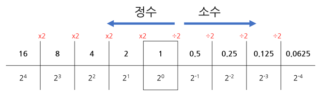
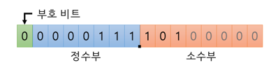
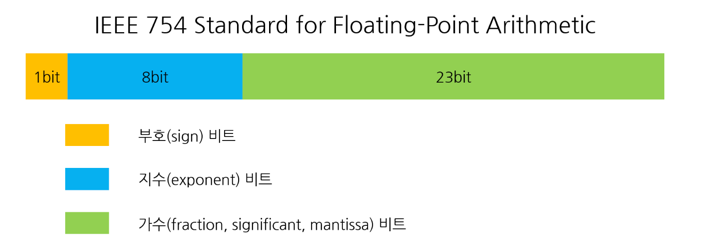

# 정확한 답이 필요하면 float과 double은 피하라

float 과 double 은 부동 소수점 방식을 사용한다. 부동 소수점은 표현할 수 있는 범위가 크지만 "근사치"로 계산하기 때문에 정확한 결과를 보장하지 않는다.

```java
System.out.println(1.03-0.42);

    RESULT=0.6000000000000001
```

그러므로 금융 계산등 정확한 값이 필요한 경우에는 Bigdecimal, int, long 을 사용해야 한다.

하지만 Bigdecimal에도 단점이 있다.

* 기본 타입에 비해 사용이 불편함
* 느리다

## 컴퓨터의 실수 표현 방식

이진수로 정수를 표현할때는 2를 나눠주는 방식으로 표현이 가능함



반대로 소수점이 들어가 있는 실수부는 2를 곱해주는 방식으로 표현을 해줘야함

0.625 * 2 = 1.25 -> 1을 빼내고 나머지 0.25 0.25 * 2 = 0.5 -> 0을 빼내고 나머지 0.5 0.5 * 2 = 1.0 -> 1을 빼내고 나머지 0

0.625 -> 0.101

위와 같은 특징때문에 0.5, 0.25 등 2로 곱했을떄 1로 잘 떨어지는 숫자는 별로 문제가 안되지만 0.789 같이 10진수 기준으로는 자릿수가 짧더라도 2진수로는 엄청나게 긴
친구들이 생김

### 고정 소수점 방식

정수부와 소수부를 반반 가지는 방식으로 구현


### 부동 소수점 방식

1.xxxxx * 2^n 방식



## BigDecimal은 어떻게 이 문제를 해결하는가?